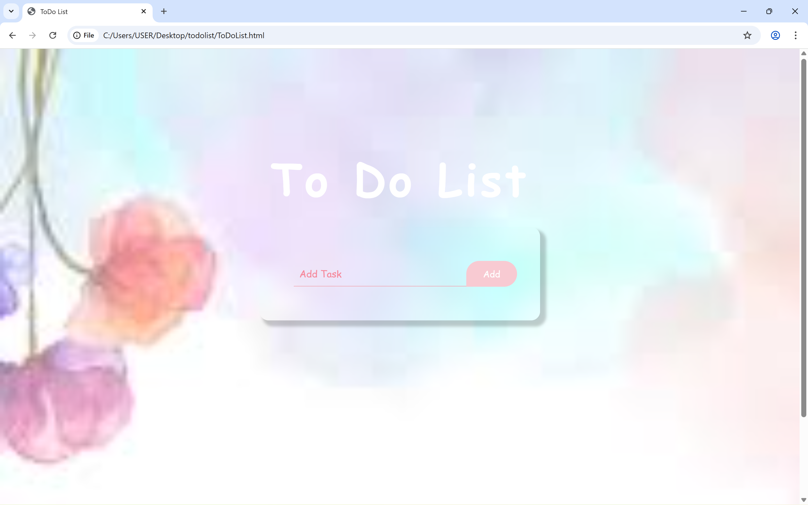

# Todo List App 

A simple and responsive Todo List application built with HTML, CSS, and Vanilla JavaScript. This project helps users manage daily tasks in a clean and minimal interface.

## Features

- Add new tasks
- Delete tasks
- Mark tasks as completed (if implemented)
- Clean and minimal UI
- Fully responsive design

## Technologies Used

- HTML5
- CSS3
- JavaScript (Vanilla JS)

## Preview

## Project Structure

Todo-App/
│
├── index.html
├── style.css
├── script.js
├── images/
└── README.md

## Live Demo

https://mehrsabuildzone.github.io/todo-list

## Notes

This project was built as a practice project to improve frontend development skills.